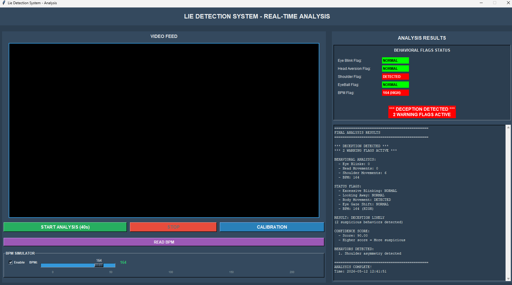
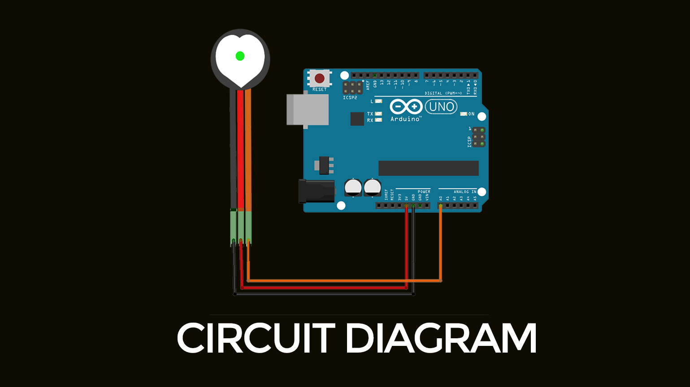

# Real-Time Multimodal Emotion & Behavioral Consistency System

A real-time computer-vision and physiological-signal prototype that analyzes behavioral indicators and identifies patterns that may be associated with inconsistent responses.

The system combines multiple signals, including facial landmarks, eye behavior, head pose, shoulder movement, and heart-rate data, to support multimodal behavioral analysis.

> **Important:** This project is a prototype for behavioral analysis. Its output should not be interpreted as proof that a person is deceptive or truthful.

## Overview

Single-signal behavioral analysis can be affected by incomplete or unreliable observations. This project explores a multimodal approach by combining several behavioral and physiological indicators.

The system performs real-time analysis and applies rule-based consistency checks across multiple signals.

## Features

### Computer Vision

- Eye blink-rate detection
- Eye-gaze tracking
- Head-pose estimation
- Shoulder-movement analysis
- Facial landmark extraction using MediaPipe

### Physiological Signal

- Heart-rate monitoring using an Arduino-connected sensor
- Baseline calibration for personalized thresholds

### Multimodal Analysis

- Combines behavioral and physiological signals
- Performs real-time signal evaluation
- Identifies patterns that may indicate behavioral inconsistency
- Displays analysis results through a Tkinter dashboard

## Technologies

- Python
- OpenCV
- MediaPipe
- Tkinter
- Arduino / C++
- SQLite
- NumPy

## System Architecture

```text
Webcam Input
      ↓
OpenCV
      ↓
MediaPipe
      ↓
Facial & Body Feature Extraction
      ↓
Behavioral Signal Analysis
      ↓
Heart-Rate Sensor
      ↓
Multimodal Signal Evaluation
      ↓
Rule-Based Consistency Analysis
      ↓
Tkinter Dashboard
```

## How It Works

1. The system captures live video through a webcam.
2. MediaPipe extracts facial and body landmarks.
3. Behavioral indicators such as blink rate, gaze direction, head pose, and shoulder movement are calculated.
4. Heart-rate information is collected through an Arduino-connected sensor.
5. A calibration phase establishes baseline values and thresholds.
6. Multiple signals are evaluated together using rule-based consistency checks.
7. The results are displayed through a real-time Tkinter dashboard.

## Project Structure

```text
Real-Time-Multimodal-Emotion-Deception-Detection-System/
│
├── src/
│   └── main.py
│
├── hardware/
│   └── Hardware.ino
│
├── data/
│   └── head_calibration.json
│
├── screenshots/
│   ├── output.png
│   └── pulse_sensor_cd.jpg
│
├── .gitattributes
├── .gitignore
├── requirements.txt
└── README.md
```

## Screenshots

### Real-Time Analysis Output



### Pulse Sensor / Hardware



## How to Run

### 1. Install dependencies

```bash
pip install -r requirements.txt
```

### 2. Run the application

```bash
python src/main.py
```

The system requires the appropriate webcam and Arduino-connected sensor hardware for the corresponding real-time features.

## Applications Explored

This prototype explores possible applications of multimodal behavioral analysis, including:

- Human-computer interaction
- Experimental behavioral analysis
- Assistive monitoring prototypes
- Computer-vision research

These are areas of exploration rather than claims of production readiness.

## Limitations

- The system is a prototype and not a validated deception-detection system.
- Behavioral signals can have many causes unrelated to deception.
- Rule-based thresholds may not generalize across users or environments.
- Physiological measurements can vary because of movement, stress, sensor placement, and other factors.
- Reliable real-world evaluation would require larger datasets and controlled validation.

## Future Improvements

- Explore machine-learning or deep-learning approaches
- Add speech and audio features
- Improve multimodal signal fusion
- Evaluate performance using larger datasets
- Improve calibration and threshold selection
- Explore web or mobile deployment

## Project Purpose

This project demonstrates how **computer vision, physiological sensing, real-time signal processing, and multimodal rule-based analysis** can be combined in an experimental behavioral-analysis system.

## Author

**Archa Sunil**

GitHub: [archasunil1111-jpg](https://github.com/archasunil1111-jpg)
